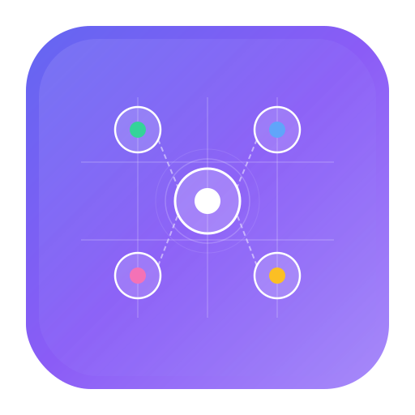

<p align="center">
  
</p>

<h1 align="center">AgentsBoard</h1>

<p align="center">
  <strong>AI Agent Mission Control for macOS</strong>
</p>

<p align="center">
  A native macOS application for monitoring, managing, and orchestrating multiple AI coding agents from a single high-performance control surface.
</p>

<p align="center">
  Built with Metal GPU rendering. Designed for developers who run Claude Code, Codex, Aider, and Gemini in parallel.
</p>

<p align="center">
  <a href="https://pjcau.github.io/AgentsBoard/">Documentation</a> •
  <a href="https://pjcau.github.io/AgentsBoard/docs/getting-started">Getting Started</a> •
  <a href="https://pjcau.github.io/AgentsBoard/docs/roadmap">Roadmap</a>
</p>

<p align="center">
  <em>Fleet Overview • Activity Log • Diff Review • Cost Tracking • Session Recording</em>
</p>

---

## Why AgentsBoard

Running multiple AI coding agents is the new normal. But today's tools force you to juggle terminal tabs, manually track costs, and copy-paste between windows. AgentsBoard fixes this.

| Problem | AgentsBoard Solution |
|---------|---------------------|
| Can't see what all agents are doing | **Fleet Overview** — all agents across all projects, sorted by priority |
| Agent modified the wrong file | **Review-in-the-loop** — approve/reject diffs before they're applied |
| No idea how much agents cost | **Cost tracking** — per-session, per-task, fleet-wide with history |
| Context switching between terminals | **GPU-rendered multi-session view** — see everything at once |
| Can't replay what happened | **Session recording** — asciicast v2 for playback and sharing |
| No programmatic control | **MCP server + CLI** — automate your agent fleet |

## Features

### Fleet Management
- **Fleet Overview** (`Cmd+Shift+F`) — Dashboard of all agents across projects, sorted by priority: needs input → errors → working → idle
- **Activity Log** (`Cmd+L`) — Structured timeline: files changed, commands run, errors, costs
- **Agent State Detection** — Automatic recognition of Claude Code, Codex, Aider, Gemini with model identification (Opus, Sonnet, GPT-4, etc.)
- **Cost Aggregation** — Per-session, per-task, fleet-wide tracking with sparkline history

### Code Review in the Loop
- **Pending Changes Preview** — Review Edit/Write/MultiEdit diffs before accepting
- **Split-pane Diff Viewer** — Inline comments and change requests sent back to the agent
- **Plan Mode** — Read-only analysis with markdown rendering, line-level annotations, batch feedback
- **Batch Review** — Collect feedback across multiple changes, send all at once

### Development Tools
- **Embedded Terminal** — Full PTY terminal (SwiftTerm) within session cards
- **File Explorer** — Project tree browser with quick-open (`Cmd+P`)
- **Code Editor** — Syntax-highlighted editing with save (`Cmd+S`)
- **Web Preview** — Framework detection, automatic dev server, live-reload
- **iOS Simulator** — Build, install, launch directly from session UI
- **Mermaid Diagrams** — Native rendering with image export

### Orchestration
- **Multi-Session Launch** — Start multiple agents in parallel
- **Smart Mode** — AI-planned task distribution across agents
- **Session Remix** — Branch into isolated git worktree with transcript context transfer
- **Git Worktree Management** — Create/delete worktrees from the UI

### Performance
- **Metal GPU Rendering** — Single MTKView, viewport scissoring, shared glyph atlas
- **Sub-4ms frame times** — Triple-buffered vertex data, zero per-frame allocations
- **<5ms input latency** — Keystroke to screen
- **<200ms startup** — Interactive in under 200 milliseconds
- **50+ sessions** — kqueue-based I/O multiplexer on a single thread

### Programmability
- **MCP Server** — JSON-RPC 2.0 over stdio for external control
- **CLI** (`agentsctl`) — Unix socket access to running instance
- **Hooks Integration** — Structured JSON events from Claude Code (authoritative source)
- **Session Recording** — Asciicast v2 format for playback and sharing

### Customization
- **Themes** — YAML-based with hot-reload
- **Layouts** — Single, List, 2-Column, 3-Column, Focus
- **Keyboard Shortcuts** — Fully configurable, vim-style command mode available
- **Command Palette** — `Cmd+K` for sessions, repos, actions
- **Notifications** — Native macOS alerts for agent state changes

## Supported Agents

| Agent | State Detection | Model Detection | Cost Tracking | Hooks |
|-------|:-:|:-:|:-:|:-:|
| Claude Code | ✓ | ✓ | ✓ | ✓ (authoritative) |
| Codex (OpenAI) | ✓ | ✓ | ✓ | — |
| Aider | ✓ | ✓ | ✓ | — |
| Gemini CLI | ✓ | ✓ | ✓ | — |

## Requirements

- macOS 14 (Sonoma) or later
- Metal-capable GPU (all Macs since 2012)
- At least one supported AI agent CLI installed

## Install

### Download
Get the latest `.dmg` from [Releases](../../releases).

### Homebrew
```bash
brew install --cask agentsboard
```

### Build from Source
```bash
git clone https://github.com/pjcau/AgentsBoard.git
cd AgentsBoard
swift build
```

## Project Configuration

Create an `agentsboard.yml` in your project root:

```yaml
name: my-project
sessions:
  - name: backend-agent
    command: claude
    workdir: ./backend
    auto_start: true

  - name: frontend-agent
    command: claude
    workdir: ./frontend
    auto_start: true

  - name: dev-server
    command: npm run dev
    workdir: ./frontend
    restart: on_failure
```

## User Configuration

`~/.config/agentsboard/config.yml`:

```yaml
theme: dark
font:
  family: "SF Mono"
  size: 13
notifications: true
scrollback: 10000
layout: fleet
```

## Keyboard Shortcuts

| Action | Shortcut |
|--------|----------|
| Command Palette | `Cmd+K` |
| Quick Open File | `Cmd+P` |
| Fleet Overview | `Cmd+Shift+F` |
| Activity Log | `Cmd+L` |
| New Session | `Cmd+N` |
| Toggle Sidebar | `Cmd+B` |
| Focus Session | `Cmd+\` |
| Next/Prev Session | `Cmd+]` / `Cmd+[` |
| Toggle Terminal Panel | `Cmd+T` |
| Command Mode (vim) | `Ctrl+Space` |
| Font Zoom | `Cmd+=` / `Cmd+-` |

## Architecture

```
Sources/
├── App/              # Entry point, composition root, window management
├── Core/             # Domain logic (zero UI dependencies) — 19 modules
│   ├── Activity/     # Event logging, structured timeline
│   ├── Agent/        # Provider abstraction, state detection
│   ├── Commands/     # Command palette backend, fuzzy matching
│   ├── Config/       # YAML config parsing
│   ├── Context/      # Cross-session context sharing
│   ├── Control/      # Unix socket control server
│   ├── CostTracking/ # Cost aggregation, pricing models, alerts
│   ├── Fleet/        # Fleet aggregation, session management
│   ├── Hooks/        # Claude Code hooks integration
│   ├── Keybindings/  # Configurable keyboard shortcuts
│   ├── MCP/          # JSON-RPC 2.0 server
│   ├── Notifications/# macOS native notifications
│   ├── Orchestration/# Smart mode, session remix, verification chains
│   ├── Persistence/  # Database layer (GRDB)
│   ├── Project/      # Project model, session grouping
│   ├── Recording/    # Asciicast v2 recording & playback
│   ├── Rendering/    # Metal renderer, glyph atlas
│   ├── Terminal/     # PTY, VT parsing, session lifecycle
│   └── Theme/        # Theme engine, built-in themes
├── UI/               # SwiftUI views + AppKit bridges — 23 modules
│   ├── SessionMonitor/   # Session cards with SwiftTerm terminal
│   ├── Launcher/         # Multi-session launcher + Smart Mode + Clone
│   ├── Sidebar/          # Session list, worktree manager, editing
│   ├── MenuBar/          # Status bar widget (cost-per-provider)
│   ├── FleetOverview/    # Fleet dashboard
│   ├── CommandPalette/   # Cmd+K command interface
│   ├── DiffReview/       # Split-pane diff viewer
│   ├── Search/           # Global search
│   ├── ... and 15 more   # Editor, FileExplorer, Themes, VimMode, etc.
└── CLI/              # agentsctl command-line tool
```

**Design principles:**
- One main thread (UI + Metal), one I/O thread (kqueue multiplexer)
- @Observable state, direct mutation, no Combine
- Core/ has zero UI dependencies — fully testable
- Provider-agnostic: add new agents without touching UI

## Privacy

AgentsBoard runs entirely on your machine. It does not collect, transmit, or store any data externally. It reads local CLI session files for monitoring purposes only.

## Credits

Inspired by and building upon ideas from:
- [AgentHub](https://github.com/jamesrochabrun/AgentHub) by James Rochabrun
- [Cosmodrome](https://github.com/rinaldofesta/cosmodrome) by Rinaldo Festa

## License

MIT
